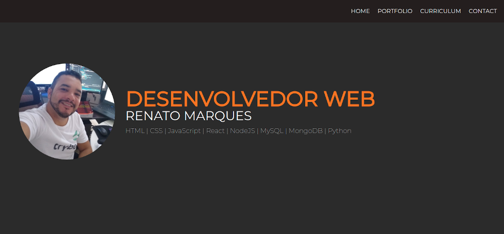
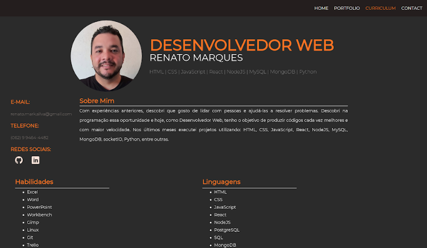
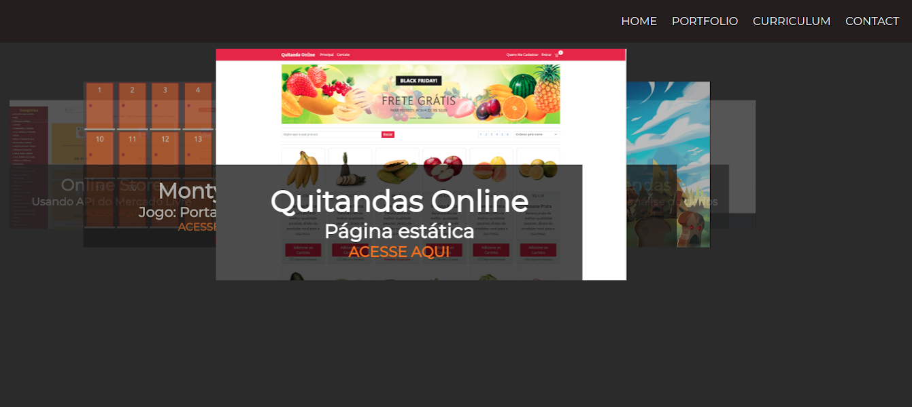

# Portfolio Web

# Sobre o projeto

Esta aplicação web foi construída com o objetivo principal de aplicar ferramentas como HTML, CSS, javascript, React e styled components.
Nesta página, intitulada "Portfolio Web”, você encontrará informações relacionadas aos projetos em que trabalhei, meu curriculum e formas de contato. 

# Tecnologias utilizadas

- HTML;
- CSS;
- JavaScript;
- ReactJS;
- styled-components.

# Layouts

   
  
  

# Acesse a aplicação no linke abaixo

[Portfólio Web](https://renatomarques-portfolioweb.netlify.app/)

## Autor
[Renato Marques](https://www.linkedin.com/in/renatomarques-dev-web/)

